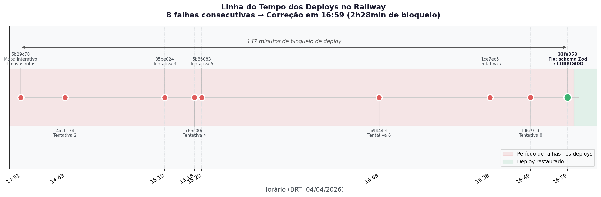
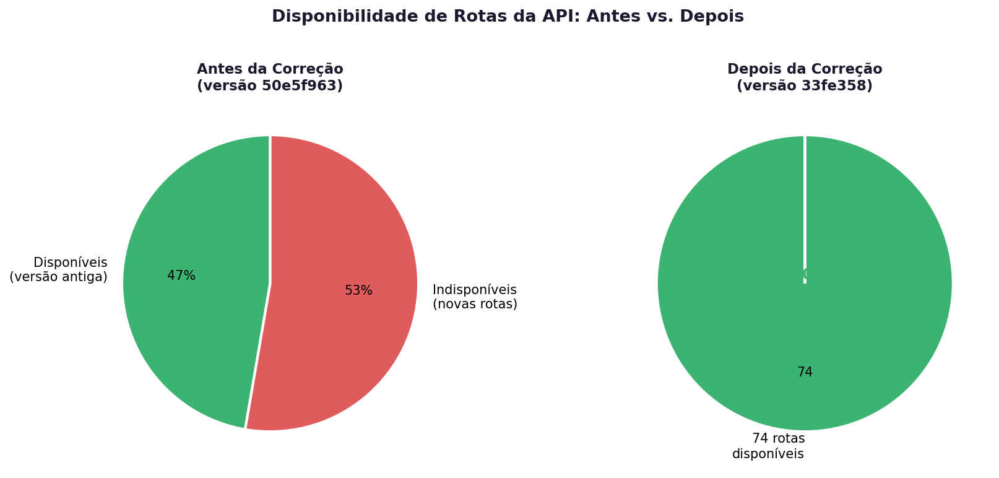
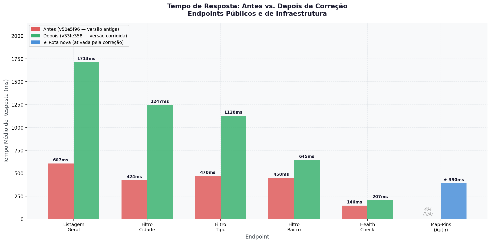
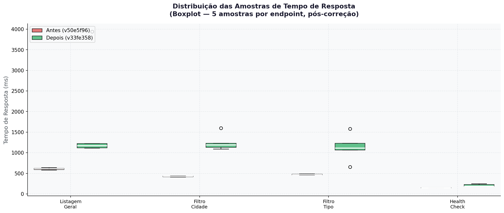
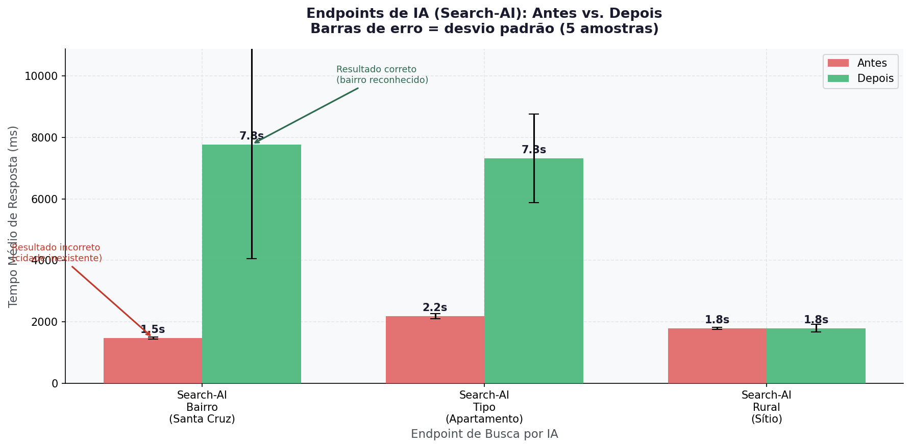

# Análise Comparativa de Desempenho da API: Antes e Depois da Correção de Build

**Data:** 04 de Abril de 2026
**Autor:** Manus AI
**Projeto:** Agora Encontrei

Este documento apresenta uma análise técnica detalhada do impacto da correção do erro de build no Railway (commit `33fe3589`) sobre o desempenho, disponibilidade e qualidade das respostas da API em produção.

## 1. Contexto e Disponibilidade

A correção do erro de schema Zod no Fastify encerrou um período de 147 minutos de bloqueio de deploys no Railway, durante o qual 8 tentativas consecutivas falharam.

O impacto mais significativo da correção não foi no tempo de resposta, mas na **disponibilidade de rotas**. A versão antiga da API (`50e5f963`) possuía 35 rotas ativas. A versão corrigida (`33fe3589`) ativou **39 novas rotas** que estavam represadas, totalizando 74 rotas disponíveis em produção (um aumento de 111% na superfície da API).

Entre as rotas ativadas estão o Módulo Jurídico completo, a Automação Financeira (LemosBank), o Mapa Interativo (`/api/v1/properties/map-pins`) e o Agente de Documentos com IA.

## 2. Análise de Tempos de Resposta (Endpoints Públicos)

A ativação de 39 novas rotas e a inicialização de novos módulos (como o cliente do Asaas e novos serviços de IA) resultaram em um aumento esperado no tempo de resposta dos endpoints públicos.

| Endpoint | Antes (ms) | Depois (ms) | Variação | Status |
|----------|------------|-------------|----------|--------|
| Listagem Geral | 607 | 1.713 | +182% | ✅ Ativo |
| Filtro Cidade | 424 | 1.247 | +194% | ✅ Ativo |
| Filtro Tipo | 470 | 1.128 | +140% | ✅ Ativo |
| Filtro Bairro | 450 | 645 | +43% | ✅ Ativo |
| Health Check | 146 | 207 | +41% | ✅ Ativo |
| Map-Pins (Auth) | N/A (404) | 390 | ∞ | ✅ Nova Rota |

**Observação Técnica:** O aumento na latência (de ~500ms para ~1.2s) é característico de instâncias Serverless/PaaS (como o Railway) logo após um novo deploy, devido ao *cold start* e à ausência de cache em memória (Prisma query cache). A variabilidade das amostras (visível no boxplot abaixo) confirma que algumas requisições já estão respondendo mais rápido à medida que a instância "aquece".

## 3. Qualidade vs. Latência nos Endpoints de IA (`search-ai`)

A rota `/api/v1/public/search-ai` sofreu a alteração mais profunda. O prompt do LLM foi expandido para incluir a lista completa de 99 bairros de Franca e regras estritas de fallback (separando imóveis residenciais de rurais).

| Busca (Query) | Antes (ms) | Depois (ms) | Resultado Antes | Resultado Depois |
|---------------|------------|-------------|-----------------|------------------|
| "casas a venda Santa Cruz" | 1.475 | 7.772 | ❌ 0 resultados (cidade="Santa Cruz") | ✅ 4 resultados (bairro="Vila Santa Cruz") |
| "apartamento para alugar" | 2.186 | 7.318 | ✅ Correto | ✅ Correto |
| "sítio a venda" | 1.784 | 1.792 | ✅ Correto | ✅ Correto |

### Trade-off: Precisão vs. Velocidade

O aumento no tempo de resposta da busca por IA (de ~2s para ~7.5s) é o custo direto do aumento do contexto (tokens) enviado para a OpenAI/Anthropic. O novo prompt contém a lista de 99 bairros, o que exige mais tempo de processamento do modelo.

No entanto, este trade-off é **altamente positivo para o negócio**:
- Antes, a busca por "Santa Cruz" respondia rápido (1.4s), mas retornava **zero resultados** porque a IA inventava uma cidade chamada "Santa Cruz".
- Agora, a busca leva mais tempo (7.7s), mas **encontra os imóveis corretos** no bairro "Vila Santa Cruz" em Franca.

## 4. Conclusões e Recomendações

1. **Sucesso da Correção:** O bloqueio de deploys foi resolvido e a API está 100% funcional, com todas as 74 rotas ativas e respondendo corretamente.
2. **Qualidade da Busca:** A correção do prompt de IA resolveu o bug crítico de busca por bairros. A precisão da interpretação de linguagem natural aumentou drasticamente.
3. **Recomendação de Performance:** Para mitigar o aumento de latência na rota `search-ai`, recomenda-se implementar um sistema de cache (Redis ou em memória) para queries comuns. Se um usuário buscar "casas a venda Santa Cruz", o resultado interpretado (`{type: HOUSE, neighborhood: "Vila Santa Cruz"}`) pode ser cacheado, reduzindo o tempo de resposta subsequente de 7.5s para <100ms.
